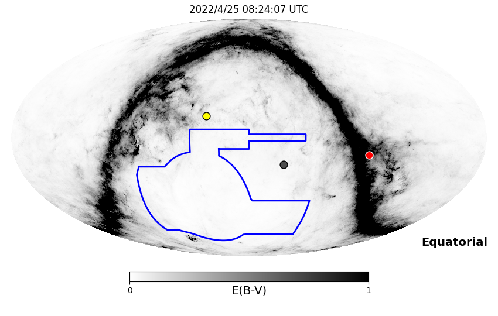
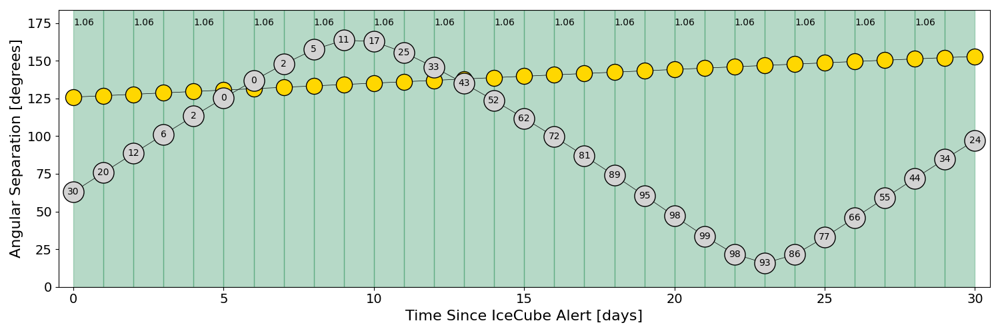
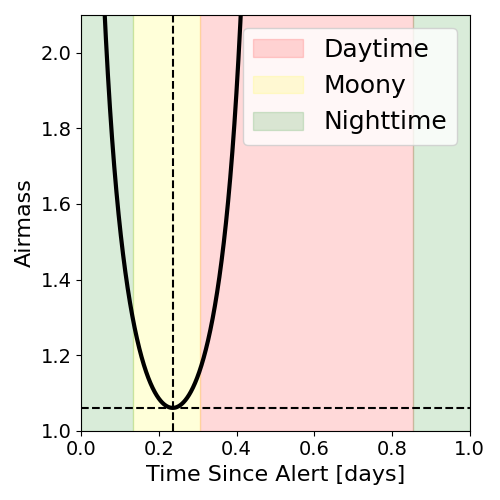
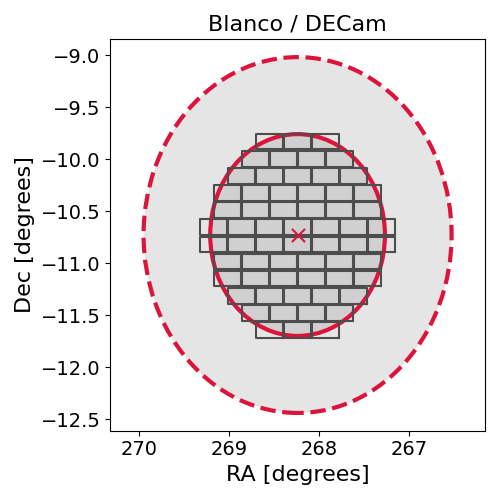
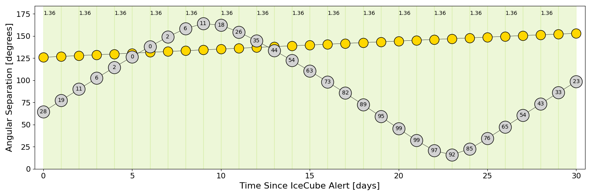
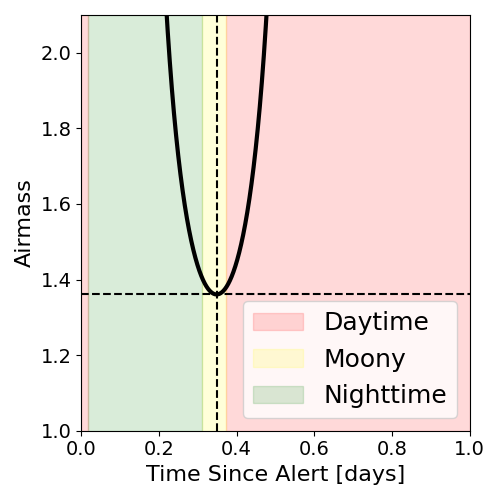
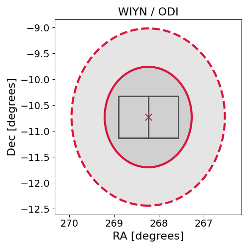

# IC220425A (136568_17854328)

### IceCube Data

| Rev | Type | Time (UTC) | Energy (TeV) | Signalness | FAR (#/yr) | 90% Area (sq. deg.) |
| --- | --- | --- | --- | --- | --- | --- |
| 1 | GOLD | 04/25/2022  02:44:57 | 603.950 | 0.169 | 0.575700 | 9.18 |

<a href="https://gcn.gsfc.nasa.gov/gcn/notices_amon_g_b/136568_17854328.amon" target="_blank">Link to IceCube Alert Details</a>

<a href="https://rmorgan10.github.io/AlertMonitoring/IC220425A_1/CTIO_skymap.png" target="_blank">
  
</a>


## CTIO Report

**Observations Start at**  `2022/04/25 03:24:07`  **Madison Time**

<a href="https://github.com/rmorgan10/AlertMonitoring/blob/main/IC220425A_1/CTIO.json" target="_blank">Link to Observing Scripts

### Alert Diagnostics

```Event
  Event ID = IC220425A
  (ra, dec) = (268.2400, -10.7300)
Date
  Now = 2022/4/25 04:17:51 (UTC)
  Search time = 2022/4/25 02:44:58 (UTC)
  Optimal time = 2022/4/25 08:24:07 (UTC)
  Airmass at optimal time = 1.06
Sun
  Angular separation = 125.85 (deg)
  Next rising = 2022/4/25 11:08:29 (UTC)
  Next setting = 2022/4/25 22:13:29 (UTC)
Moon
  Illumination = 0.30
  Angular separation = 62.94 (deg)
  Next rising = 2022/4/25 05:55:38 (UTC)
  Next setting = 2022/4/25 19:38:05 (UTC)
  Next new moon = 2022/4/30 20:28:02 (UTC)
  Next full moon = 2022/5/16 04:14:05 (UTC)
Galactic
  (l, b) = (16.5891, 7.8054)
  E(B-V) = 0.16
```
### Observability Plots

<a href="https://rmorgan10.github.io/AlertMonitoring/IC220425A_1/CTIO_forecast.png" target="_blank">
  
</a>

<a href="https://rmorgan10.github.io/AlertMonitoring/IC220425A_1/CTIO_airmass.png" target="_blank">
  
</a>
<a href="https://rmorgan10.github.io/AlertMonitoring/IC220425A_1/CTIO_fov.png" target="_blank">
  
</a>


## KPNO Report

**Observations Start at**  `2022/04/25 06:06:51`  **Madison Time**

<a href="https://github.com/rmorgan10/AlertMonitoring/blob/main/IC220425A_1/KPNO.json" target="_blank">Link to Observing Scripts

### Alert Diagnostics

```Event
  Event ID = IC220425A
  (ra, dec) = (268.2400, -10.7300)
Date
  Now = 2022/4/25 04:17:51 (UTC)
  Search time = 2022/4/25 02:44:58 (UTC)
  Optimal time = 2022/4/25 11:06:51 (UTC)
  Airmass at optimal time = 1.36
Sun
  Angular separation = 125.95 (deg)
  Next rising = 2022/4/25 12:46:08 (UTC)
  Next setting = 2022/4/26 02:02:58 (UTC)
Moon
  Illumination = 0.29
  Angular separation = 64.40 (deg)
  Next rising = 2022/4/25 10:11:14 (UTC)
  Next setting = 2022/4/25 21:14:31 (UTC)
  Next new moon = 2022/4/30 20:28:02 (UTC)
  Next full moon = 2022/5/16 04:14:05 (UTC)
Galactic
  (l, b) = (16.5891, 7.8054)
  E(B-V) = 0.16
```
### Observability Plots

<a href="https://rmorgan10.github.io/AlertMonitoring/IC220425A_1/KPNO_forecast.png" target="_blank">
  
</a>

<a href="https://rmorgan10.github.io/AlertMonitoring/IC220425A_1/KPNO_airmass.png" target="_blank">
  
</a>
<a href="https://rmorgan10.github.io/AlertMonitoring/IC220425A_1/KPNO_fov.png" target="_blank">
  
</a>

