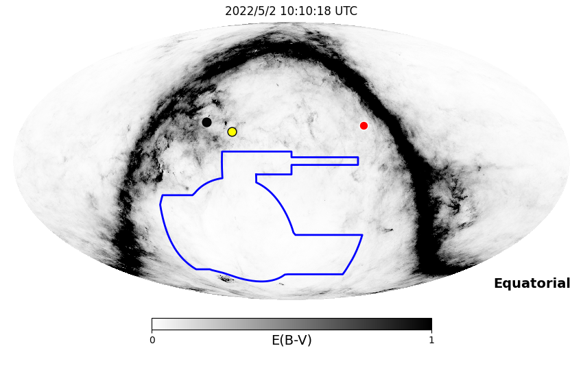
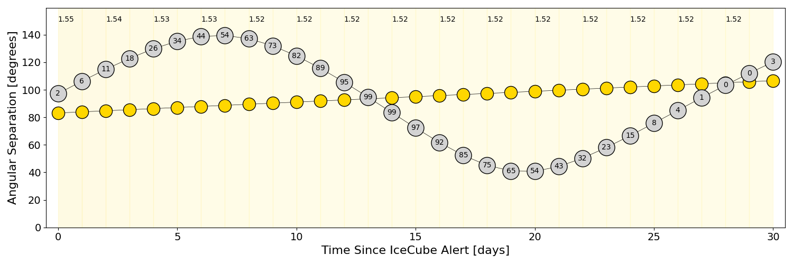
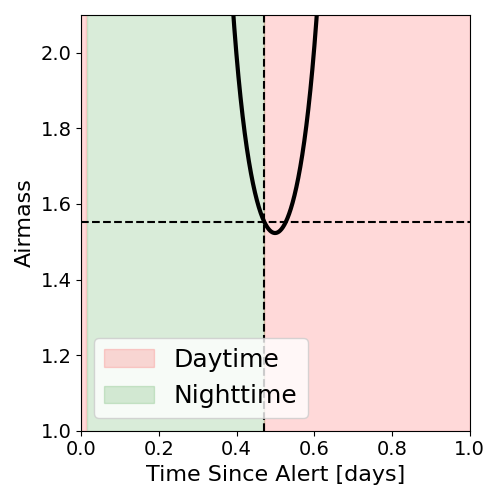
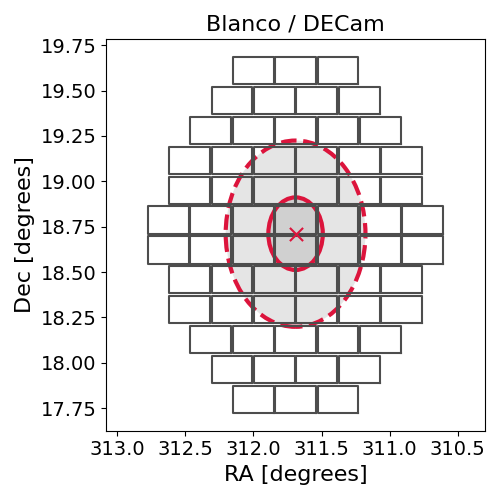
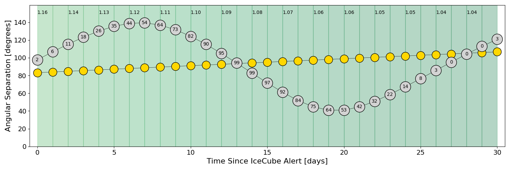
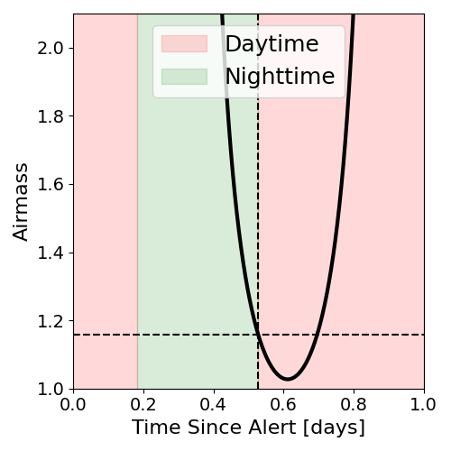
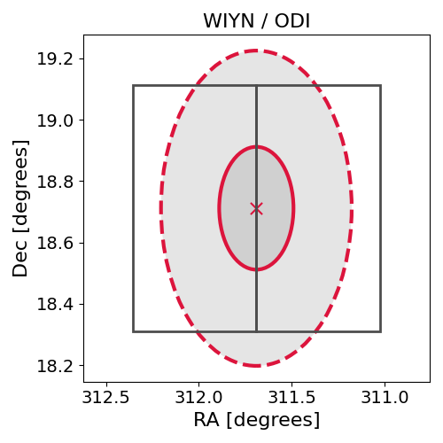

# IC220501A (136588_56014830)

### IceCube Data

| Rev | Type | Time (UTC) | Energy (TeV) | Signalness | FAR (#/yr) | 90% Area (sq. deg.) |
| --- | --- | --- | --- | --- | --- | --- |
| 0 | BRONZE | 05/01/2022  22:50:58 | 127.030 | 0.396 | 2.109600 | 0.83 |

<a href="https://gcn.gsfc.nasa.gov/gcn/notices_amon_g_b/136588_56014830.amon" target="_blank">Link to IceCube Alert Details</a>

<a href="https://rmorgan10.github.io/AlertMonitoring/IC220501A_0/CTIO_skymap.png" target="_blank">
  
</a>


## CTIO Report

**Observations Start at**  `2022/05/02 05:10:17`  **Madison Time**

<a href="https://github.com/rmorgan10/AlertMonitoring/blob/main/IC220501A_0/CTIO.json" target="_blank">Link to Observing Scripts

### Alert Diagnostics

```Event
  Event ID = IC220501A
  (ra, dec) = (311.6906, 18.7115)
Date
  Now = 2022/5/1 23:02:17 (UTC)
  Search time = 2022/5/1 22:50:59 (UTC)
  Optimal time = 2022/5/2 10:10:18 (UTC)
  Airmass at optimal time = 1.55
Sun
  Angular separation = 83.15 (deg)
  Next rising = 2022/5/2 11:12:55 (UTC)
  Next setting = 2022/5/2 22:07:09 (UTC)
Moon
  Illumination = 0.02
  Angular separation = 97.21 (deg)
  Next rising = 2022/5/2 12:48:36 (UTC)
  Next setting = 2022/5/2 23:20:24 (UTC)
  Next new moon = 2022/5/30 11:30:13 (UTC)
  Next full moon = 2022/5/16 04:14:05 (UTC)
Galactic
  (l, b) = (63.6887, -15.0827)
  E(B-V) = 1.15
```
### Observability Plots

<a href="https://rmorgan10.github.io/AlertMonitoring/IC220501A_0/CTIO_forecast.png" target="_blank">
  
</a>

<a href="https://rmorgan10.github.io/AlertMonitoring/IC220501A_0/CTIO_airmass.png" target="_blank">
  
</a>
<a href="https://rmorgan10.github.io/AlertMonitoring/IC220501A_0/CTIO_fov.png" target="_blank">
  
</a>


## KPNO Report

**Observations Start at**  `2022/05/02 06:31:39`  **Madison Time**

<a href="https://github.com/rmorgan10/AlertMonitoring/blob/main/IC220501A_0/KPNO.json" target="_blank">Link to Observing Scripts

### Alert Diagnostics

```Event
  Event ID = IC220501A
  (ra, dec) = (311.6906, 18.7115)
Date
  Now = 2022/5/1 23:02:17 (UTC)
  Search time = 2022/5/1 22:50:59 (UTC)
  Optimal time = 2022/5/2 11:31:40 (UTC)
  Airmass at optimal time = 1.16
Sun
  Angular separation = 83.19 (deg)
  Next rising = 2022/5/2 12:39:14 (UTC)
  Next setting = 2022/5/2 02:07:13 (UTC)
Moon
  Illumination = 0.03
  Angular separation = 97.73 (deg)
  Next rising = 2022/5/2 13:45:23 (UTC)
  Next setting = 2022/5/2 03:12:36 (UTC)
  Next new moon = 2022/5/30 11:30:13 (UTC)
  Next full moon = 2022/5/16 04:14:05 (UTC)
Galactic
  (l, b) = (63.6887, -15.0827)
  E(B-V) = 1.15
```
### Observability Plots

<a href="https://rmorgan10.github.io/AlertMonitoring/IC220501A_0/KPNO_forecast.png" target="_blank">
  
</a>

<a href="https://rmorgan10.github.io/AlertMonitoring/IC220501A_0/KPNO_airmass.png" target="_blank">
  
</a>
<a href="https://rmorgan10.github.io/AlertMonitoring/IC220501A_0/KPNO_fov.png" target="_blank">
  
</a>

