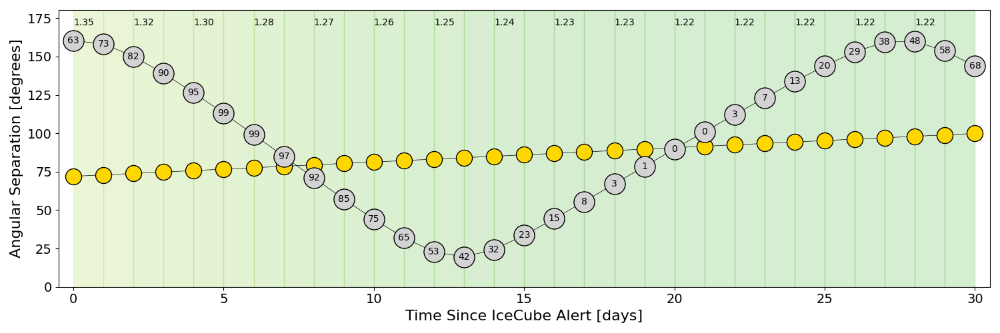
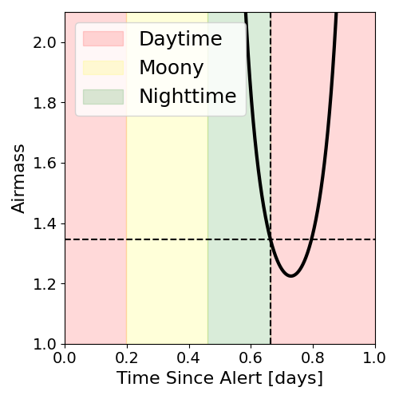
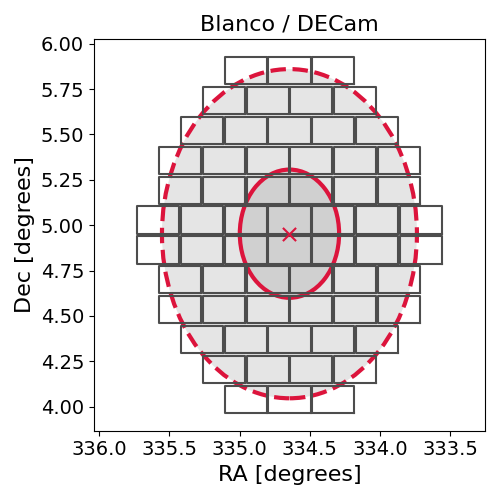
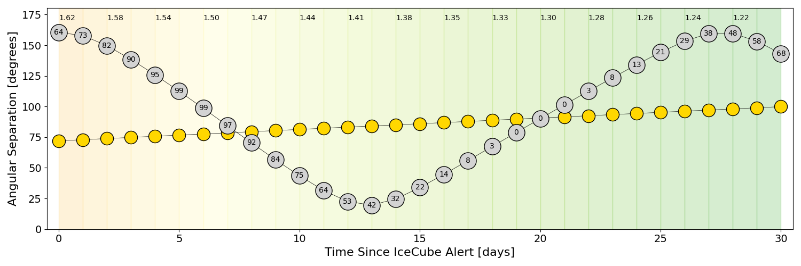
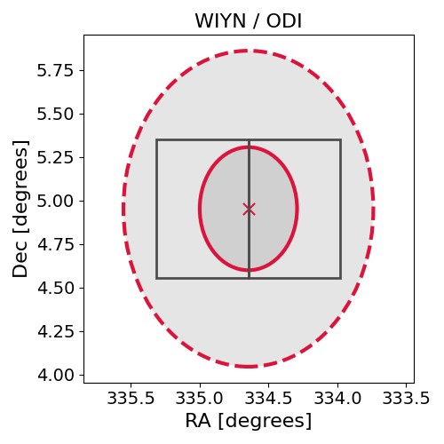

# IC220509A (136615_14688828)

### IceCube Data

| Rev | Type | Time (UTC) | Energy (TeV) | Signalness | FAR (#/yr) | 90% Area (sq. deg.) |
| --- | --- | --- | --- | --- | --- | --- |
| 0 | GOLD | 05/09/2022  18:19:04 | 176.810 | 0.446 | 1.534300 | 2.59 |

<a href="https://gcn.gsfc.nasa.gov/gcn/notices_amon_g_b/136615_14688828.amon" target="_blank">Link to IceCube Alert Details</a>

<a href="https://rmorgan10.github.io/AlertMonitoring/IC220509A_0/CTIO_skymap.png" target="_blank">
  
</a>


## CTIO Report

**Observations Start at**  `2022/05/10 05:14:44`  **Madison Time**

<a href="https://github.com/rmorgan10/AlertMonitoring/blob/main/IC220509A_0/CTIO.json" target="_blank">Link to Observing Scripts

### Alert Diagnostics

```Event
  Event ID = IC220509A
  (ra, dec) = (334.6456, 4.9529)
Date
  Now = 2022/5/9 18:32:17 (UTC)
  Search time = 2022/5/9 18:19:04 (UTC)
  Optimal time = 2022/5/10 10:14:45 (UTC)
  Airmass at optimal time = 1.35
Sun
  Angular separation = 71.99 (deg)
  Next rising = 2022/5/10 11:18:02 (UTC)
  Next setting = 2022/5/9 22:01:40 (UTC)
Moon
  Illumination = 0.64
  Angular separation = 160.30 (deg)
  Next rising = 2022/5/9 18:21:47 (UTC)
  Next setting = 2022/5/10 05:23:58 (UTC)
  Next new moon = 2022/5/30 11:30:13 (UTC)
  Next full moon = 2022/5/16 04:14:05 (UTC)
Galactic
  (l, b) = (68.0714, -41.0936)
  E(B-V) = 0.09
```
### Observability Plots

<a href="https://rmorgan10.github.io/AlertMonitoring/IC220509A_0/CTIO_forecast.png" target="_blank">
  
</a>

<a href="https://rmorgan10.github.io/AlertMonitoring/IC220509A_0/CTIO_airmass.png" target="_blank">
  
</a>
<a href="https://rmorgan10.github.io/AlertMonitoring/IC220509A_0/CTIO_fov.png" target="_blank">
  
</a>


## KPNO Report

**Observations Start at**  `2022/05/10 06:23:17`  **Madison Time**

<a href="https://github.com/rmorgan10/AlertMonitoring/blob/main/IC220509A_0/KPNO.json" target="_blank">Link to Observing Scripts

### Alert Diagnostics

```Event
  Event ID = IC220509A
  (ra, dec) = (334.6456, 4.9529)
Date
  Now = 2022/5/9 18:32:17 (UTC)
  Search time = 2022/5/9 18:19:04 (UTC)
  Optimal time = 2022/5/10 11:23:18 (UTC)
  Airmass at optimal time = 1.62
Sun
  Angular separation = 72.04 (deg)
  Next rising = 2022/5/10 12:32:25 (UTC)
  Next setting = 2022/5/10 02:12:54 (UTC)
Moon
  Illumination = 0.64
  Angular separation = 160.37 (deg)
  Next rising = 2022/5/9 19:41:58 (UTC)
  Next setting = 2022/5/10 09:27:08 (UTC)
  Next new moon = 2022/5/30 11:30:13 (UTC)
  Next full moon = 2022/5/16 04:14:05 (UTC)
Galactic
  (l, b) = (68.0714, -41.0936)
  E(B-V) = 0.09
```
### Observability Plots

<a href="https://rmorgan10.github.io/AlertMonitoring/IC220509A_0/KPNO_forecast.png" target="_blank">
  
</a>

<a href="https://rmorgan10.github.io/AlertMonitoring/IC220509A_0/KPNO_airmass.png" target="_blank">
  
</a>
<a href="https://rmorgan10.github.io/AlertMonitoring/IC220509A_0/KPNO_fov.png" target="_blank">
  
</a>

