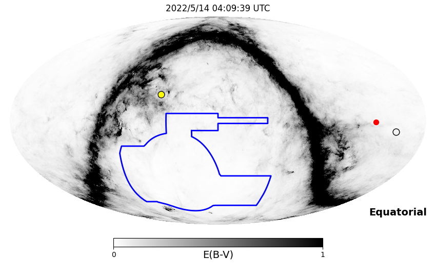
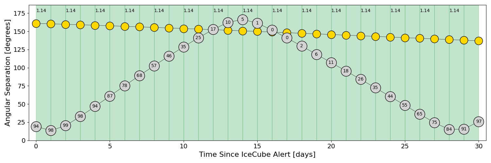
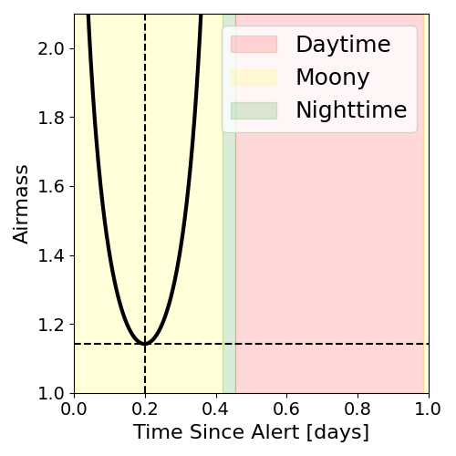
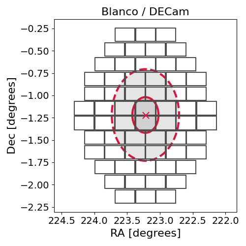
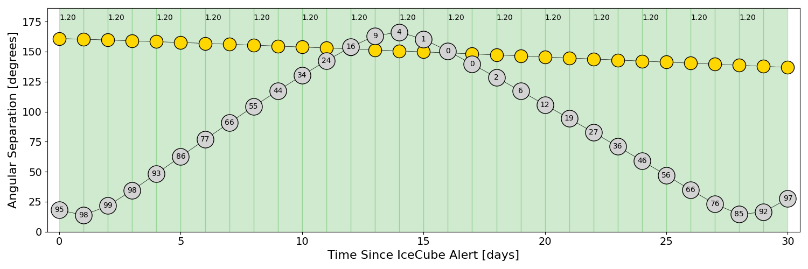
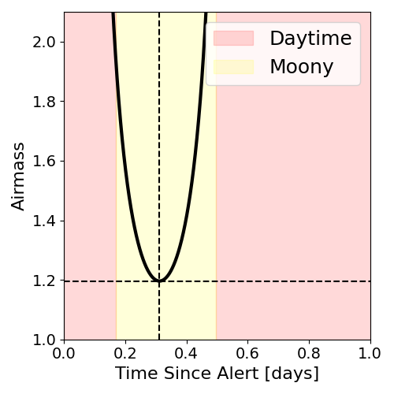
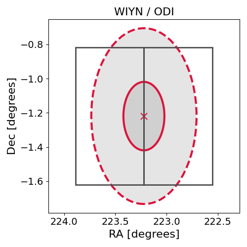

# IC220513A (136627_61640402)

### IceCube Data

| Rev | Type | Time (UTC) | Energy (TeV) | Signalness | FAR (#/yr) | 90% Area (sq. deg.) |
| --- | --- | --- | --- | --- | --- | --- |
| 0 | GOLD | 05/13/2022  23:23:12 | 207.920 | 0.560 | 0.942500 | 0.83 |

<a href="https://gcn.gsfc.nasa.gov/gcn/notices_amon_g_b/136627_61640402.amon" target="_blank">Link to IceCube Alert Details</a>

<a href="https://rmorgan10.github.io/AlertMonitoring/IC220513A_0/CTIO_skymap.png" target="_blank">
  
</a>


## CTIO Report

**Observations Start at**  `2022/05/13 23:09:39`  **Madison Time**

<a href="https://github.com/rmorgan10/AlertMonitoring/blob/main/IC220513A_0/CTIO.json" target="_blank">Link to Observing Scripts

### Alert Diagnostics

```Event
  Event ID = IC220513A
  (ra, dec) = (223.2208, -1.2193)
Date
  Now = 2022/5/13 23:32:16 (UTC)
  Search time = 2022/5/13 23:23:13 (UTC)
  Optimal time = 2022/5/14 04:09:39 (UTC)
  Airmass at optimal time = 1.14
Sun
  Angular separation = 161.01 (deg)
  Next rising = 2022/5/14 11:20:34 (UTC)
  Next setting = 2022/5/14 21:58:21 (UTC)
Moon
  Illumination = 0.95
  Angular separation = 19.20 (deg)
  Next rising = 2022/5/14 21:02:18 (UTC)
  Next setting = 2022/5/14 09:28:19 (UTC)
  Next new moon = 2022/5/30 11:30:13 (UTC)
  Next full moon = 2022/5/16 04:14:05 (UTC)
Galactic
  (l, b) = (353.7214, 49.2929)
  E(B-V) = 0.01
```
### Observability Plots

<a href="https://rmorgan10.github.io/AlertMonitoring/IC220513A_0/CTIO_forecast.png" target="_blank">
  
</a>

<a href="https://rmorgan10.github.io/AlertMonitoring/IC220513A_0/CTIO_airmass.png" target="_blank">
  
</a>
<a href="https://rmorgan10.github.io/AlertMonitoring/IC220513A_0/CTIO_fov.png" target="_blank">
  
</a>


## KPNO Report

**Observations Start at**  `2022/05/14 01:52:23`  **Madison Time**

<a href="https://github.com/rmorgan10/AlertMonitoring/blob/main/IC220513A_0/KPNO.json" target="_blank">Link to Observing Scripts

### Alert Diagnostics

```Event
  Event ID = IC220513A
  (ra, dec) = (223.2208, -1.2193)
Date
  Now = 2022/5/13 23:32:16 (UTC)
  Search time = 2022/5/13 23:23:13 (UTC)
  Optimal time = 2022/5/14 06:52:23 (UTC)
  Airmass at optimal time = 1.20
Sun
  Angular separation = 160.94 (deg)
  Next rising = 2022/5/14 12:29:30 (UTC)
  Next setting = 2022/5/14 02:15:42 (UTC)
Moon
  Illumination = 0.95
  Angular separation = 18.11 (deg)
  Next rising = 2022/5/13 23:48:22 (UTC)
  Next setting = 2022/5/14 11:28:57 (UTC)
  Next new moon = 2022/5/30 11:30:13 (UTC)
  Next full moon = 2022/5/16 04:14:05 (UTC)
Galactic
  (l, b) = (353.7214, 49.2929)
  E(B-V) = 0.01
```
### Observability Plots

<a href="https://rmorgan10.github.io/AlertMonitoring/IC220513A_0/KPNO_forecast.png" target="_blank">
  
</a>

<a href="https://rmorgan10.github.io/AlertMonitoring/IC220513A_0/KPNO_airmass.png" target="_blank">
  
</a>
<a href="https://rmorgan10.github.io/AlertMonitoring/IC220513A_0/KPNO_fov.png" target="_blank">
  
</a>

