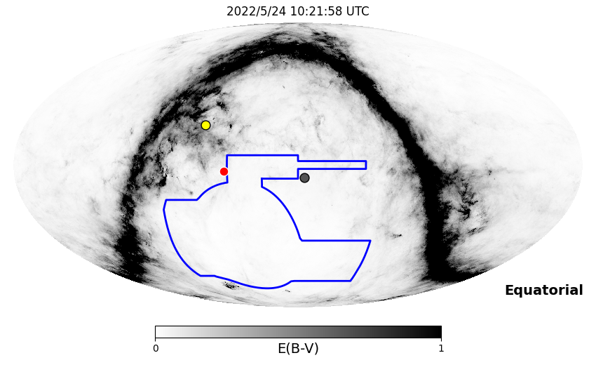
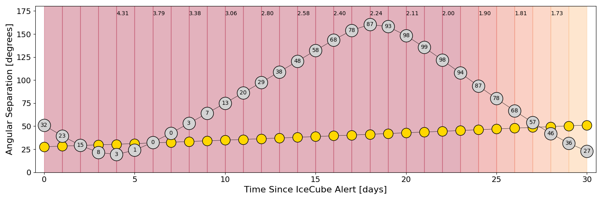
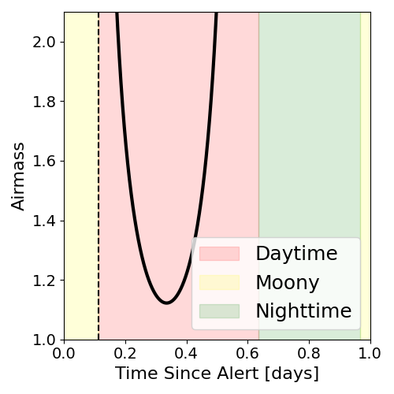
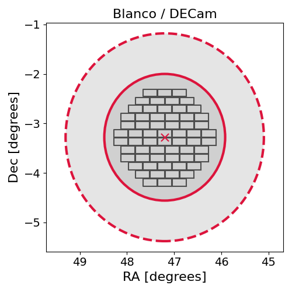
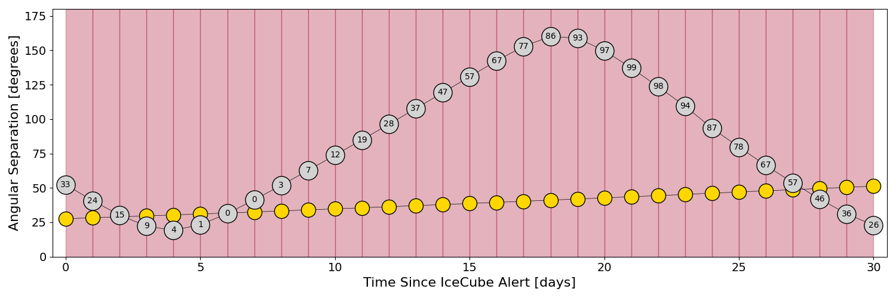
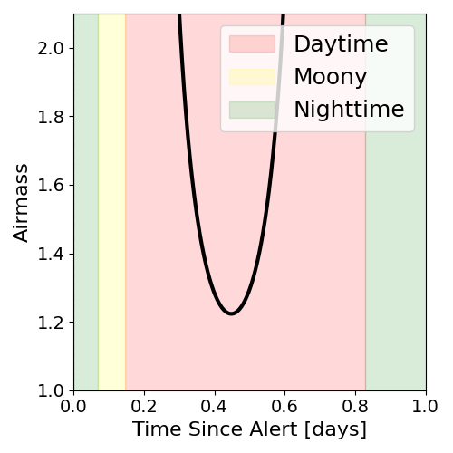
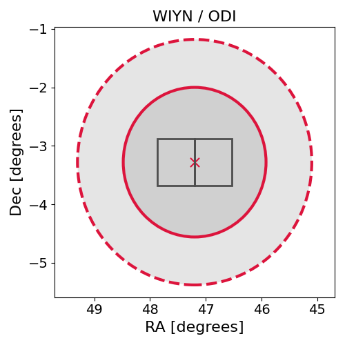

# IC220524A (136662_35405932)

### IceCube Data

| Rev | Type | Time (UTC) | Energy (TeV) | Signalness | FAR (#/yr) | 90% Area (sq. deg.) |
| --- | --- | --- | --- | --- | --- | --- |
| 1 | BRONZE | 05/24/2022  07:41:32 | 116.040 | 0.336 | 2.855600 | 13.85 |

<a href="https://gcn.gsfc.nasa.gov/gcn/notices_amon_g_b/136662_35405932.amon" target="_blank">Link to IceCube Alert Details</a>

<a href="https://rmorgan10.github.io/AlertMonitoring/IC220524A_1/CTIO_skymap.png" target="_blank">
  
</a>


## CTIO Report

**Observations Start at**  `2022/05/24 05:21:58`  **Madison Time**

<a href="https://github.com/rmorgan10/AlertMonitoring/blob/main/IC220524A_1/CTIO.json" target="_blank">Link to Observing Scripts

### Alert Diagnostics

```Event
  Event ID = IC220524A
  (ra, dec) = (47.2000, -3.2799)
Date
  Now = 2022/5/24 12:27:14 (UTC)
  Search time = 2022/5/24 07:41:32 (UTC)
  Optimal time = 2022/5/24 10:21:58 (UTC)
  Airmass at optimal time = 6.02
Sun
  Angular separation = 27.73 (deg)
  Next rising = 2022/5/24 11:26:41 (UTC)
  Next setting = 2022/5/24 21:53:18 (UTC)
Moon
  Illumination = 0.33
  Angular separation = 50.95 (deg)
  Next rising = 2022/5/25 06:52:54 (UTC)
  Next setting = 2022/5/24 18:45:11 (UTC)
  Next new moon = 2022/5/30 11:30:13 (UTC)
  Next full moon = 2022/6/14 11:51:42 (UTC)
Galactic
  (l, b) = (182.9461, -49.4420)
  E(B-V) = 0.04
```
### Observability Plots

<a href="https://rmorgan10.github.io/AlertMonitoring/IC220524A_1/CTIO_forecast.png" target="_blank">
  
</a>

<a href="https://rmorgan10.github.io/AlertMonitoring/IC220524A_1/CTIO_airmass.png" target="_blank">
  
</a>
<a href="https://rmorgan10.github.io/AlertMonitoring/IC220524A_1/CTIO_fov.png" target="_blank">
  
</a>


## KPNO Report

**Observations Start at**  `2022/05/24 02:41:32`  **Madison Time**

<a href="https://github.com/rmorgan10/AlertMonitoring/blob/main/IC220524A_1/KPNO.json" target="_blank">Link to Observing Scripts

### Alert Diagnostics

```Event
  Event ID = IC220524A
  (ra, dec) = (47.2000, -3.2799)
Date
  Now = 2022/5/24 12:27:14 (UTC)
  Search time = 2022/5/24 07:41:32 (UTC)
  Optimal time = 2022/5/24 07:41:32 (UTC)
  Airmass at optimal time = 999.00
Sun
  Angular separation = 27.65 (deg)
  Next rising = 2022/5/24 12:23:46 (UTC)
  Next setting = 2022/5/25 02:23:05 (UTC)
Moon
  Illumination = 0.34
  Angular separation = 52.28 (deg)
  Next rising = 2022/5/24 09:18:35 (UTC)
  Next setting = 2022/5/24 21:12:11 (UTC)
  Next new moon = 2022/5/30 11:30:13 (UTC)
  Next full moon = 2022/6/14 11:51:42 (UTC)
Galactic
  (l, b) = (182.9461, -49.4420)
  E(B-V) = 0.04
```
### Observability Plots

<a href="https://rmorgan10.github.io/AlertMonitoring/IC220524A_1/KPNO_forecast.png" target="_blank">
  
</a>

<a href="https://rmorgan10.github.io/AlertMonitoring/IC220524A_1/KPNO_airmass.png" target="_blank">
  
</a>
<a href="https://rmorgan10.github.io/AlertMonitoring/IC220524A_1/KPNO_fov.png" target="_blank">
  
</a>

